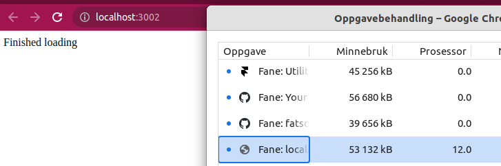

# Framer motion cpu usage issue

Here you see the Chrome tab rendering nothing but text and being idle use 12 percent CPU.
If profiling this in Chrome you will quickly spot framer-motion.js as the culprit.
Since this loader is so simple and more or less straight from the getting started docs
where `repeat:Infinity` is being used, it seems it should not be like this.

I would have expected that the cpu usage should fall to 0 when the react component 
has been unmounted, but it seems FM keep the render loop going for infinity.



## To reproduce
Install the code
```
npm i
npx vite
```
Now, open the link and watch the animation take place. Then open Chrome's Task Manager and check out the cpu usage for the current tab after the animation has subsided.
It should stay at about 12%. If you change the code so that `repeat=3`, it should quickly die off.
