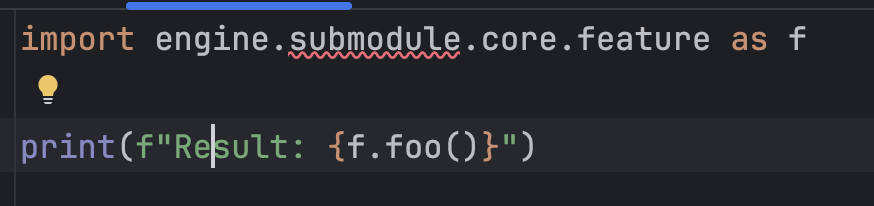
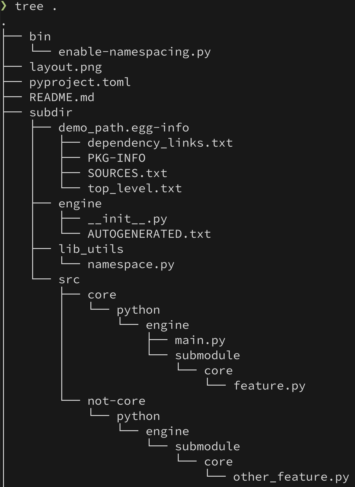

# PyCharm Issue when manipulating __path__ 

## The problem

IntelliJ (2025.1.6 Ultimate Edition) does not recognise this:


You cannot navigate to submodules of `engine`, even though Python has no issues with this

```bash
❯ uv run python -c 'import engine.main'
my feature is running
Result: 42
```

## Background knowledge
In Python, you can manipulate the `__path__` variable that is available 
in a package's `__init__.py` file. This variable contains a _list_ of the
locations that Python will look for this package and its submodules. 

_Unfortunately, this does not work in IntelliJ (or derivatives like PyCharm)_

For instance, in this demo project you have this weird directory layout:


The two modules feature.py and other_feature.py live in different folders, 
yet are part of the same namespace by having an __init__.py in a top-level 
package called `engine` that essentially does this:
```
    __path__.append("../src/core/python")
    __path__.append("../src/not-core/python")
```

That enables us to do this:
```bash
✦ ❯ uv run python -c 'import engine.submodule.core.feature'
my feature is running

✦ ❯ uv run python -c 'import engine.submodule.core.other_feature'
not core
```

## Reproduction

- Install the deps in a VirtualEnv (assuming `uv` is installed): `uv sync`
- Open the project: `idea .`
- Configure the project to use the SDK in the `.venv`
- Open `main.py`
- Observe red squigglies
